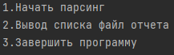
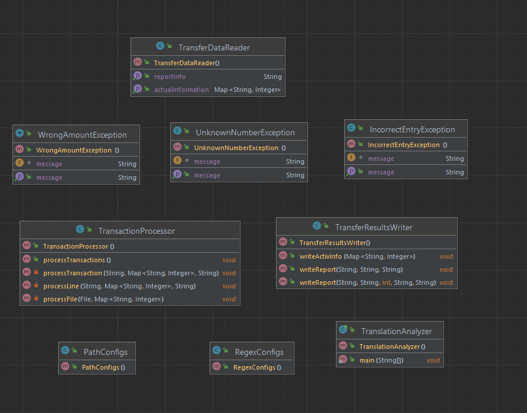

# Transfer Analyzer
This project implements the transfer of funds from one account to another.
The project implements the analysis of text files with transfer data and their processing.
The activeInfo directory in the file activeInfo.txt contains data on account numbers and their funds.
After analyzing the files from the input directory ,up-to-date information is updated,
files from the input directory are transferred to the archive directory.
The status of the transfers is recorded in the report directory in the report.txt file,
that is, whether they were successful or some error occurred during the processing stage.
## Usage example
The program begins with the console asking you to select the course of the program

1.Start processing files from the input directory and further processing\
2.Output of a report file that contains translation statuses\
3.End of program
## class diagram

## Technologies used
Java SE 17
## Project Status
Stable version
## Contacts
Sergey\
mrchnksrg1@mail.com

